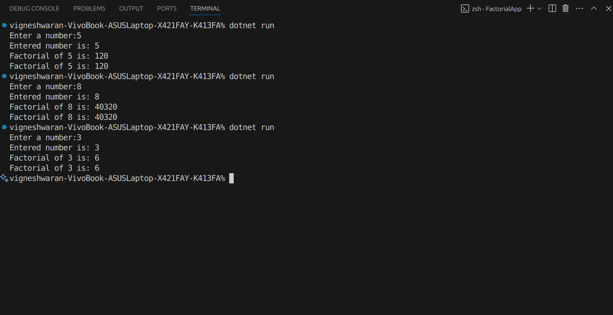

# Basic Data Types, Control Structures, and Methods

# Objective & Requirements:
- Write a console application that calculates the factorial of a given
number.
- Read an integer from the user.
- Validate the input (ensure it’s a positive integer).
- Use loops (or recursion) to calculate the factorial.
- Display the result in the console.

# Result

