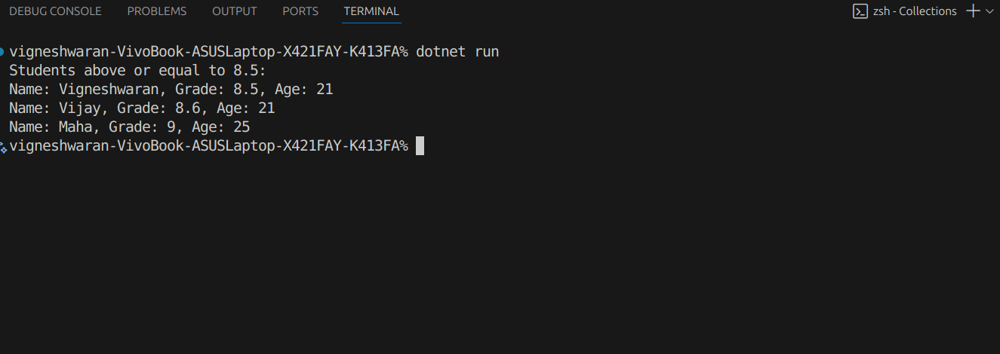

# Working with Collections and LINQ
# Objective & Requirements:
1. Create a student management console application.
2. Define a Student class with properties such as Name , Grade , and Age .
3. Populate a collection (e.g., a List<Student> ) with sample data.
4. Use LINQ to:
- Filter students who have a grade above a certain threshold.
- Sort the filtered results by name or grade.
5. Display the filtered and sorted list.

# Result
