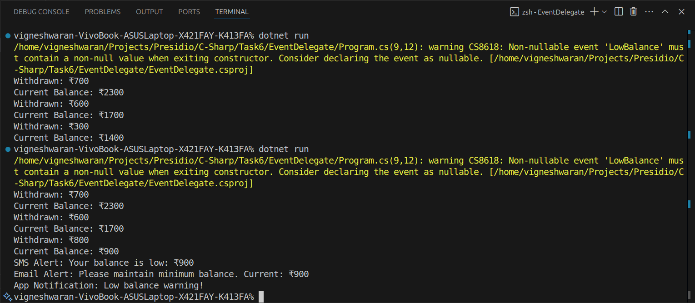

# Delegates, Events, and Basic Event Handling
# Objective & Requirements:
- Build a console-based event-driven application (e.g., a counter that
triggers an event at a threshold).
- Define a delegate and an event that fires when a counter reaches a
specific value.
- Create multiple event handler methods that perform actions when the
event is raised.
- In your main loop, increment the counter and raise the event when
appropriate.
- Demonstrate how events can decouple the producer and consumer
logic.

# Result

