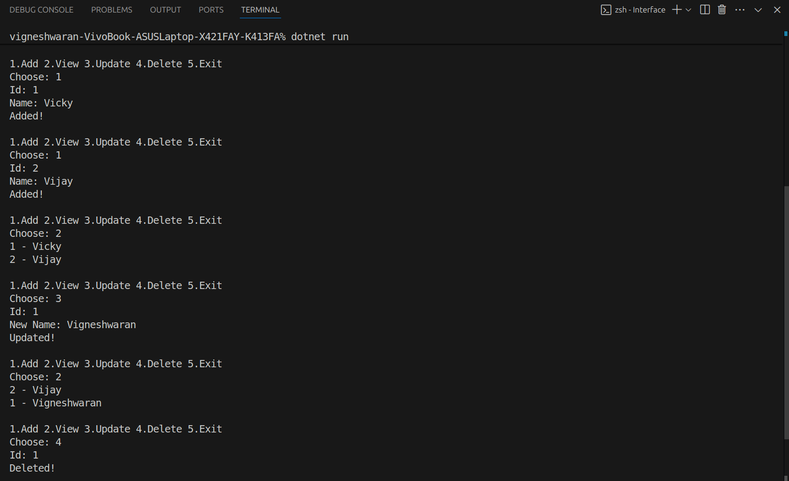

# Generics and Interfaces with a Repository Pattern
# Objective:Requirements:
- Implement a generic in-memory repository to perform CRUD
operations.
- Define an interface (e.g., IRepository<T> ) with methods like Add , Get ,
Update , and Delete .
- Create a generic class that implements this interface.
- Use type constraints if necessary (e.g., where T : class or
implementing a specific interface).
- Write a simple console UI to demonstrate the repository with a sample
entity (e.g., Product or Student ).

# Output

