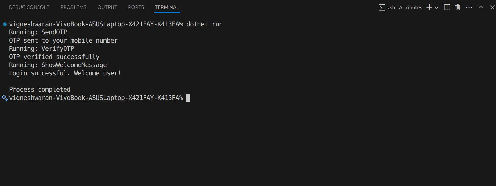

# Reflection and Custom Attributes
# Objective & Requirements:
1. Build an application that discovers and executes methods based on
custom attributes.
2. Define a custom attribute (e.g., [Runnable] ).
3. Create several classes with methods decorated with the [Runnable]
attribute.
4. Use reflection to scan the current assembly for methods marked with
[Runnable] .
5. Invoke the discovered methods dynamically and display their outputs.

# Output

